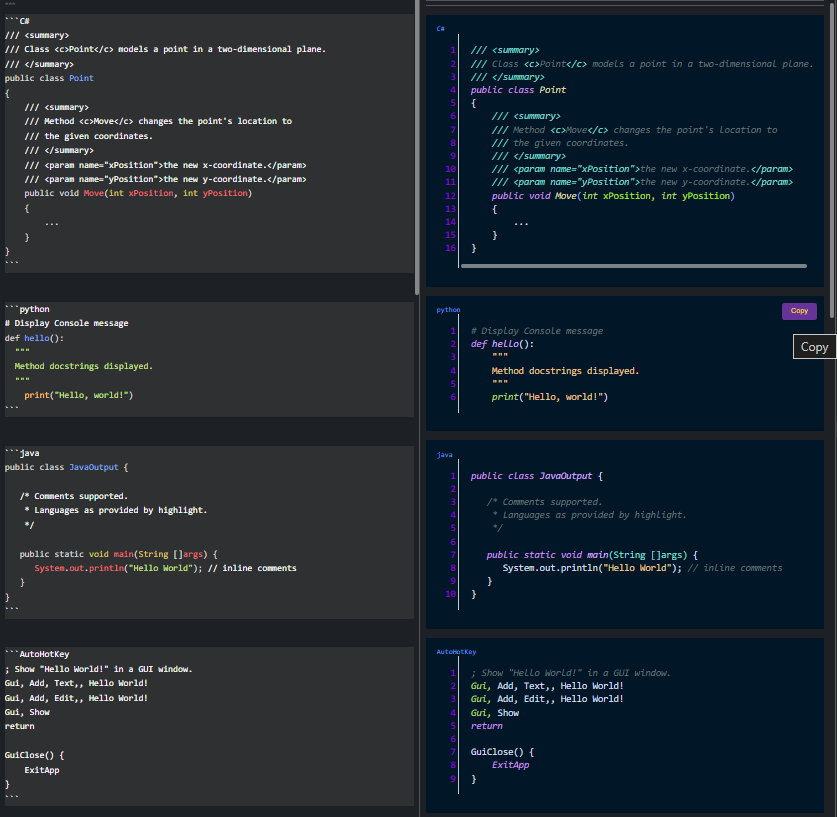
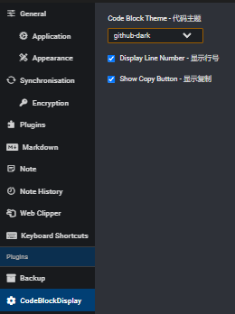

<link rel="stylesheet" type="text/css" href="./img/plugin.css">

# Code Block Display (Joplin plugin)

[**`joplin-plugin-code-block-display`**](https://github.com/joseajohnson/joplin-plugin-code-block-display)


A lightweight Joplin plugin that improves code blocks in notes by adding themed syntax highlighting, optional line numbers, a one-click Copy button, and a visible language label for each fenced code block.

Designed for writers, developers, and researchers who keep runnable snippets or code examples in Joplin.

- [Code Block Display (Joplin plugin)](#code-block-display-joplin-plugin)
  - [Screenshots](#screenshots)
    - [Editor and Markdown Preview:](#editor-and-markdown-preview)
    - [Settings Control Panel:](#settings-control-panel)
  - [Why use this plugin?](#why-use-this-plugin)
    - [Key features](#key-features)
  - [Installation](#installation)
  - [Usage](#usage)
  - [Settings](#settings)
  - [Troubleshooting](#troubleshooting)
  - [For plugin authors / contributors](#for-plugin-authors--contributors)
  - [Contributing](#contributing)
  - [License](#license)

## Screenshots

*Screenshots are in the `img/` folder of this repository.*

### Editor and Markdown Preview:

<div class="image-container">



</div>

***

### Settings Control Panel:

Demo all available Themes with Syntax samples at [Theme Examples - highlight.js](https://highlightjs.org/examples):
With support for ~200 languages and themes, see how every language looks like in every theme.

<div class="image-container">



</div>

***

## Why use this plugin?

<br  class="spacer" />

- **Readability:** Themed syntax highlighting makes code easier to scan and understand in long documents.
- **Quick copy:** One-click Copy writes the exact snippet to your clipboard — saves time when transferring examples into editors or REPLs.
- **Context at a glance:** A visible language label above each rendered block tells readers the language (for multi-language documents this avoids guesswork).
- **Precise references:** Line numbers make it simple to point to examples or quote exact lines.
- **Offline & fast:** Runs inside Joplin using bundled `highlight.js`; no external network calls required.
- **Fold / collapse code blocks:** A new Fold button sits in the language title bar (next to the Copy button) to hide/show the rendered code block while keeping the language label and buttons visible.

### Key features

<br  class="spacer" />

- Themed syntax highlighting using [`Highlight.js`](https://highlightjs.org/) themes (many themes are bundled).
- Optional line numbering displayed alongside each highlighted block.
- One-click Copy button with visual feedback (Copied) and clipboard integration.
- Language label inserted above highlighted blocks using `data-joplin-language` — useful for readers and for consistent styling.
  - Code folding (collapse/expand) via a Fold button placed in the language title bar; the folded block is hidden but the label and buttons remain visible.
- Configurable settings (theme, show/hide line numbers, show/hide copy button).
- Updates rendered note view in response to changes to the Editor.

***

## Installation

<br  class="spacer" />

1. Install from the Joplin Plugin Repository: open Joplin → Tools → Options → Plugins → Install new plugin and search for "Code Block Display".
2. Or install manually:
   - Download the `.jpl` from the `publish/` folder or clone this repository.
   - In Joplin go to Tools → Options → Plugins → Install plugin from file and choose the `.jpl` file.

After install, enable the plugin and restart Joplin if required.

## Usage

<br  class="spacer" />

- Create fenced code blocks in Markdown as usual:

``````markdown
```javascript
console.log('hello')
```
``````

- On render, the plugin highlights the block, shows a language label, and displays a Copy button, optional line numbers, and Fold and Copy buttons in the language header.
  - Click Fold to hide/show the highlighted block while keeping the header visible.

- Settings are available in the plugin settings panel to change the theme, toggle line numbers, and enable/disable the Copy button.

## Settings

<br  class="spacer" />

- **Theme** — choose a Highlight.js theme to apply to code blocks.
- **Show line numbers** — toggle the line number column.
- **Show copy button** — toggle the one-click copy feature.

***

## Troubleshooting

- If code blocks do not highlight or the language label is missing:
  - Make sure the plugin is enabled in Joplin and the CSS files are loaded (Tools → Options → Plugins → Code Block Display → check settings).
  - Open Developer Tools in Joplin (Help → Toggle Developer Tools) and look for plugin console messages. The plugin logs initialization and errors to help debug.
  - If you customized themes, verify the theme file exists under `src/highlight/styles` or your packaged plugin CSS.

- If Copy doesn't work:
  - Ensure Joplin permissions allow clipboard access (usually enabled by default for plugins).
  - Check the plugin console output for messages when clicking the Copy button.

***

## For plugin authors / contributors

<br  class="spacer" />

- The plugin bundles a trimmed copy of [`highlight.js`](https://github.com/highlightjs/highlight.js#getting-started) *`v11.10.0`* for offline usage. If you'd like to add or update languages or themes, update the `src/highlight` folder and rebuild.
- To modify behavior around language labels, see the Markdown-It fence renderer `src/codeBlockDisplay.ts`.

> - *Forked from [`joplin-plugin-code-perfect` by **jl15988**](https://github.com/jl15988/joplin-plugin-code-perfect), `v1.0.3`*
> - *[文件 汉语](./README_ZH.md)*


## Contributing

<br  class="spacer" />

Contributions, bug reports and pull requests are welcome. Please open issues on the repository and follow the existing code style for changes.

## License

This project is licensed under the MIT License. See the `LICENSE` file for details.

- [Change log](./CHANGELOG.md)
- [修改日志](./CHANGE_LOG_ZH.md)
